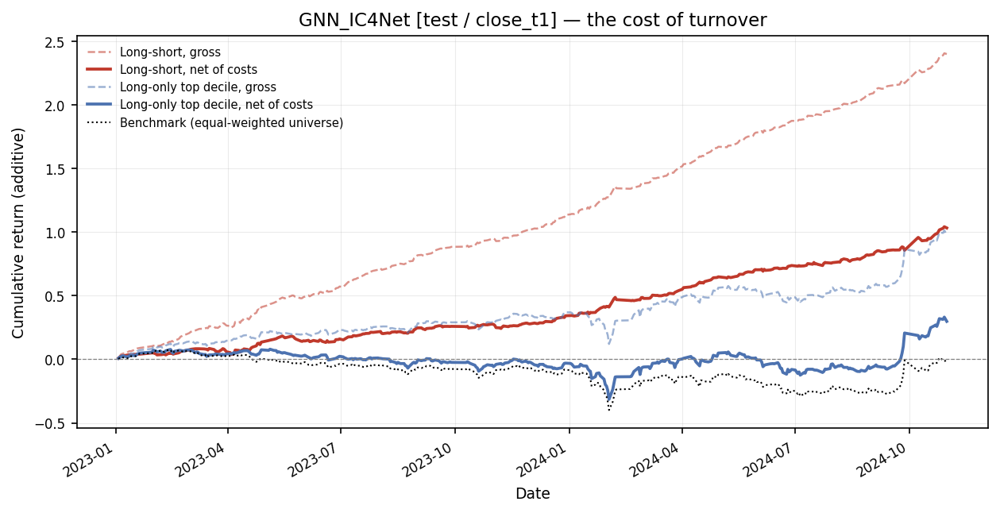

# Industry-aware GNN for CSI1000 stock picking

A cross-sectional alpha model for the CSI 1000 universe. Each stock is scored
from its own factor values, then **corrected by what its nearest
same-industry, similar-size peers look like that day**.

The correction is the point. A stock's raw factor values say how it looks in
absolute terms; they don't say whether it looks that way because of something
specific to the company or because its whole industry does. A high-turnover
reading means something different for a semiconductor name in a week when
every semiconductor name is turning over than it does in a quiet week. The
model builds a graph of same-industry peers each day, aggregates over it, and
learns a correction term from the gap.

Trained on **2019-2022**, evaluated on **2023-2024** with no refitting.

---

## The model

For stock *i* on date *t*, with standardized features `x`:

```
h_self  = MLP_self(x)                              own-stock representation
base    = Linear(h_self)                           own-stock score
p       = mean of x over i's k nearest same-industry peers
d       = x - p                                    deviation from those peers
h_graph = GraphSAGE(x, edges)                      one hop of mean aggregation
delta   = MLP_graph([x, h_self, p, d, h_graph])    the industry correction
score   = base + alpha * delta
```

`alpha` is learned but squashed into a narrow band (default `[0.1, 0.3]`).
That bound is a design commitment, not a hyperparameter that happened to work:
if the graph branch were unbounded, the cheapest early loss reduction is to
lean entirely on peer means, and the result is a factor that ranks *industries*
rather than stocks. Bounding `alpha` keeps the graph a refinement of `base`.

### The graph

One graph per trading day, rebuilt from that day's cross-section:

- **Nodes** — every CSI 1000 constituent with a known industry and at least
  one non-missing feature.
- **Edges** — within each industry, connect each stock to its `k = 10`
  nearest peers by size. Size is proxied by the CSI 1000 index weight, which
  is free-float-cap weighted, so ordering by weight orders by float cap.
- Two edge sets come out of the same k-NN step, and the distinction matters.
  The **directed** set (i to its own k peers) defines the peer mean `p`; it
  stays directed and exactly-k so a crowded mid-cap's peer mean doesn't
  silently absorb every small-cap that picked *it*. The **symmetrized** set
  with self-loops is what GraphSAGE aggregates over, because message passing
  wants an undirected neighbourhood.
- A stock alone in its industry that day gets `p = x`, so its deviation is
  exactly zero — "no peer information" rather than a zero vector that would
  read downstream as "maximally cheap versus peers".

Graphs depend on no model parameter, so they are built once and reused across
every epoch.

### The objective

Everything is computed **per date**, then averaged over the dates in a batch:

```
loss = -IC + 0.05 * Huber(z(score), z(label)) + 0.01 * relu(0.3 - std(score))^2
```

- **-IC** is the term that matters: the daily cross-sectional correlation
  between score and forward return.
- **Huber** is mild shaping. IC alone is scale- and shift-invariant, which
  leaves the score's level unconstrained and makes early optimisation wander.
- **variance collapse** penalises a cross-section whose score spread has
  shrunk below a floor. Since -IC doesn't care about scale, nothing else
  stops the network from drifting toward near-constant output and letting
  float noise carry the correlation.

Pooling returns across dates instead would let a few high-volatility days
dominate the gradient and would reward predicting the market's direction —
not what a cross-sectional factor is for.

---

## Results

Trained on 2019-01-01 .. 2022-12-31; the test numbers come from a model that
never saw a label from the test window.

**The holding period is close to close.** The signal is formed from day T's
session and the position is entered in that day's closing auction, held
through the overnight gap, and exited at the T+1 close. That is the strategy
this model is built for, and `close_t1` — today's close to tomorrow's close —
is its P&L. It is also exactly the label the model is trained on, so the
objective and the evaluation measure the same thing.

Returns are computed on the full listed panel before the universe filter, so
they measure the stock's genuine next trading day rather than its next day in
the index.

**Every portfolio number is reported gross and net of transaction costs.** At
~78% daily turnover the gross figures are not a result, they are an upper
bound, so the net column is the one that matters. The cost stack is China
A-share specific:

| component | rate | side | note |
| --- | --- | --- | --- |
| Stamp duty (印花税) | 5 bps | sell only | 10 bps before 2023-08-28, when China halved it |
| Brokerage commission (佣金) | 2.5 bps | both | institutional-ish; the ¥5 minimum is ignored |
| Transfer fee (过户费) | 0.1 bps | both | Shanghai and Shenzhen since 2022 |
| Slippage / market impact | 5 bps | both | assumption — the softest number here |
| Short borrow (融券) | 800 bps | short leg | annualised financing, long-short only |

A round trip is therefore ~20.2 bps, and the stamp-duty cut lands inside the
test window, so the backtest pays 25.2 bps before 2023-08-28 and 20.2 bps
after rather than one blended rate. Slippage is the assumption most worth
arguing with: 5 bps per side is moderate for CSI 1000 names at modest size
and will be too low for a large book. `--slippage-bps` overrides it;
`--no-costs` reproduces the gross figures.

<!-- RESULTS_TABLE -->

Windows: 2019-01-02 .. 2022-12-29 | 2023-01-03 .. 2024-11-01

| metric | Train (in-sample) | **Test (out-of-sample)** |
| --- | --- | --- |
| Trading days | 876 | 396 |
| Mean RankIC | 0.1104 | 0.0891 |
| RankIC std | 0.0637 | 0.0837 |
| **ICIR** | **1.734** | **1.066** |
| IC > 0 frequency | 95.9% | 86.1% |
| IC t-stat | 51.3 | 21.2 |
| Top-decile daily turnover | 77.4% | 78.4% |
| Daily cost drag | 19.5 bps | 17.2 bps |
| Top decile, mean daily — gross | 0.4620% | 0.2474% |
| Top decile, mean daily — **net** | **0.2670%** | **0.0752%** |
| Bottom decile, mean daily — gross | -0.5188% | -0.3580% |
| Bottom decile, mean daily — net | -0.6990% | -0.4989% |
| Benchmark (equal-weighted), mean daily | 0.0356% | -0.0073% |
| Long-short Sharpe — gross | 21.30 | 10.25 |
| **Long-short Sharpe — net** | **12.47** | **4.41** |
| Long-only Sharpe — gross | 4.68 | 2.43 |
| **Long-only Sharpe — net** | **2.70** | **0.74** |
| Long-only Sharpe, net excess of benchmark | 7.51 | 2.52 |
| Benchmark Sharpe | 0.39 | -0.07 |
| Long-short annualised return — gross | 1062.4% | 352.9% |
| **Long-short annualised return — net** | **320.2%** | **90.6%** |
| Long-only annualised return — gross | 209.8% | 80.5% |
| **Long-only annualised return — net** | **89.9%** | **17.0%** |
| Benchmark annualised return | 6.5% | -4.9% |
| Long-short max drawdown — net | -3.1% | -5.1% |
| Decile monotonicity — gross | 1.000 | 1.000 |
| Decile monotonicity — net | 1.000 | 1.000 |

<!-- /RESULTS_TABLE -->

### Out-of-sample backtest, 2023-01-03 .. 2024-11-01

Every figure below is regenerated by `python scripts/reproduce_run.py`; the
full set, including the training window, is in [`docs/figures/`](docs/figures).

One convention to keep straight while reading them: the **curves are additive**
(`cumsum`), matching the parent framework's charts, while the **annualised
returns in the table are geometric**. The curves are there to show the shape
of a track record — where it stalls, where it gaps — not to be read off at the
right-hand edge. Reading the end of an additive curve as a compounded return
overstates a result badly.

Decile cumulative returns net of costs, with the gross long-short leg drawn
faintly behind the net one. The fan opens cleanly and never crosses — Q10 on
top, Q1 at the bottom, every rank in between where it belongs, and the
ordering survives costs intact (net monotonicity 1.000):


**The signal survives costs, but only just, and only at the top.** Gross,
every decile from Q6 up is positive. Net, the ~17 bps daily drag is larger
than the gross return of all but one bucket, so **Q10 is the only decile that
stays above water** at +0.075% a day:


That is the practical finding. The factor's ranking is sound across the whole
cross-section — the ordering is perfectly monotone before and after costs —
but at this turnover only the extreme buckets are tradable. A strategy built
on it has to be concentrated in the top decile (or run long-short), not a
broad tilt across the upper half.

The cumulative curves put a size on what costs take:



Long-short falls from **352.9% annualised gross to 90.6% net** — costs take
three quarters of it — and the Sharpe drops from 10.25 to **4.41**. The
long-only top decile gives up more in relative terms, 80.5% to **17.0%**,
Sharpe 2.43 to **0.74**, because it has no short leg to carry half the spread.
Both stay positive, which is the non-obvious part: a 78%-turnover signal
usually does not.

Treat the long-short annualised figure as a scale, not a forecast. It
compounds a daily-rebalanced spread at full notional on each leg, assumes
every fill at the reference price, and assumes the short side is borrowable —
and it says nothing about capacity, which for a book turning over 78% a day
in CSI 1000 small caps is the real ceiling. The Sharpe and the IC are the
figures that transfer; the return level scales down with size.

The long-only net Sharpe of 0.74 looks unremarkable until you compare it with
what the market did. The equal-weighted CSI 1000 returned **-4.9% annualised**
over these dates, at a Sharpe of -0.07, so none of that 17.0% is market drift.
Stripping the market exposure leaves a net excess Sharpe of **2.52** — the
market-neutral view of the same result, and the honest one for a
stock-selection signal.

The RankIC series shows where the stability comes from: IC is positive on 86%
of days rather than being carried by a few large ones. Note that IC itself is
cost-independent — it measures ranking quality, not P&L — which is why it is
the metric to watch when comparing model variants, and the net Sharpes are
the metric to watch when deciding whether to trade one.


### Barra style and industry attribution

Each day the standardized factor is regressed on that day's Barra style
exposures and industry dummies with no intercept — the dummies partition the
universe and already act as one. Averaging the daily coefficients gives the
factor's mean tilt; `1 - R²` is the share no known style or industry explains.


**84% of the factor is unexplained by any Barra style or industry** — which,
for a signal meant to be alpha rather than a repackaged risk premium, is the
result you want. Of the 16% that is explained:

- **Low residual volatility (-0.29)** is by far the strongest style tilt. The
  factor systematically prefers calmer names. This is the one exposure large
  enough to matter for risk budgeting, and it is a known compensated factor —
  some of the measured edge is being paid for bearing it in reverse.
- **Small negative size / non-linear size / liquidity** (-0.05 to -0.10): a
  mild tilt toward smaller, less liquid names, unsurprising in a CSI 1000
  universe and worth watching because it compounds the turnover problem.
- **Growth, leverage and earnings yield are essentially zero** — the four
  fundamental inputs are not driving the signal.
- **Industry tilts are small** — every one of the 31 sits within ±0.11 except
  the two financials. Long agriculture (+0.10), steel (+0.10), pharma (+0.09);
  short banks (-0.43) and non-bank financials (-0.15). The bank tilt is the
  one concentrated bet in the book and is four times the next largest.

That the industry tilts stay small is a direct check on the architecture's
central claim: bounding `alpha` was supposed to keep the graph branch from
turning the factor into an industry ranking, and the attribution says it did.

Reproduce all of the above with `python scripts/reproduce_run.py`. The metrics
table is rendered from the run's own output by
`scripts/update_readme_results.py`, so the numbers cannot drift from the
artifacts they came from.

---

## Inputs

22 factors, the set kept after the elastic-net / IC screening in the parent
research project: twelve intraday minute-bar structure factors, six daily
technical factors, and four point-in-time fundamental ratios.

| group | factors |
| --- | --- |
| Intraday structure (12) | `1.1 Q3`, `1.2 M4`, `1.4 lz 10`, `1.7 DealRecovery Slope 30min`, `1.8 EarlyAfternoonRecovery VolumeWeighted VolatilityAdjusted`, `1.9 ExtremeHighReversal Last30Min`, `1.10 UpsideVolRatio Vol5DivVol20`, `1.11 VWAP Close Ratio Last30Min`, `1.12 VolumeConcentration Last30Min PriceWeighted`, `HF_GapII_SUM3D`, `PMCloseRange`, `Dratio` |
| Daily technical (6) | `AmountMA20`, `AmountIR5`, `ATR5`, `VEMA5`, `VRSI60`, `VR_N` |
| Fundamental, point-in-time (4) | `EP_TTM`, `SP1_TTM`, `CurrentAssetsTRate`, `FC_AssetImpairmentToRevenue_TTM` |

`python -m iagnn features` prints the exact column contract.

### Data contract

The raw inputs — ~16 GB of CSI 1000 1-minute bars plus point-in-time financial
statements — are **not distributed with this repository**. The pipeline's
input is a *prepared feature panel*: a parquet with

| column | type | meaning |
| --- | --- | --- |
| `date` | `datetime64` | one row per stock per trading day |
| `instrument` | `str` | 6-digit ticker, zero-padded, no exchange suffix |
| *22 feature columns* | `float` | named exactly as listed above |

plus the research framework's `factors/<year>/` tree for daily prices, index
weights, and `secucode_industry_map.csv`.

`python -m iagnn prepare` builds the panel when the parent framework is
importable; otherwise supply the parquet yourself in the shape above.

---

## Usage

```bash
pip install -e ".[dev]"

# 1. build the 22-feature panel (needs the parent research framework)
python -m iagnn prepare \
    --framework-root /path/to/backtest_framework \
    --output artifacts/feature_panel.parquet

# 2. train on 2019-2022, score everything, evaluate 2023-2024
python -m iagnn run \
    --feature-panel artifacts/feature_panel.parquet \
    --factor-dir /path/to/backtest_framework/factors

# 3. re-report metrics from saved scores, without retraining
python -m iagnn evaluate \
    --scores artifacts/GNN_IC4Net_scores.parquet \
    --factor-dir /path/to/backtest_framework/factors
```

Or from Python:

```python
import iagnn

cfg = iagnn.default_config(
    feature_panel_path="artifacts/feature_panel.parquet",
    factor_dir="/path/to/backtest_framework/factors",
)
result = iagnn.run(cfg)
print(result.summary())
print(result.test_metrics["icir"])
```

`iagnn run` writes, into `artifacts/`: the scored factor, per-window RankIC
series and decile returns, a metrics table, the training history, a torch
checkpoint, a torch-free JSON weight dump, and a config manifest. Figures go
to `docs/figures/` — four per (window, holding period) plus the Barra
attribution, which needs `--barra-dir` pointing at the exposure parquets and
is skipped without complaint when they are absent. `--no-figures` turns the
whole figure step off; `--no-costs`, `--slippage-bps` and `--commission-bps`
adjust the cost stack. It also
writes the scored factor into the parent framework's `factors/<year>/` tree in
that project's own file layout, so its single-factor test picks the factor up
unchanged (`--no-framework-output` disables this).

---

## Layout

```
src/iagnn/
  config.py       every knob, as dataclasses; serialises to a run manifest
  features.py     the 22-factor contract (+ a drift check against the parent project)
  ingest.py       optional bridge that builds the feature panel
  data.py         panel assembly: features + prices + index weights + industry
  preprocess.py   same-day winsorize / z-score / forward-return label
  graph.py        per-date industry k-NN graphs, and batched collation
  model.py        SparseMeanSAGE + the residual scorer
  losses.py       per-date IC objective
  trainer.py      training and scoring loops
  evaluate.py     RankIC, ICIR, decile returns, Sharpes gross and net
  costs.py        China A-share cost stack, turnover, net-of-cost returns
  barra.py        style/industry attribution by daily cross-sectional regression
  plots.py        the five figures, in the parent framework's house style
  report.py       turns a finished run into figures
  export.py       checkpoints, JSON weights, framework hand-off
  pipeline.py     end-to-end orchestration
  cli.py          `python -m iagnn ...`
scripts/          one-command reproduction; README table renderer
docs/figures/     the committed backtest figures the README shows
tests/            50 tests; run with `pytest`
```

---

## Design notes and limitations

**Batching across dates is exact, not an approximation.** A batch merges its
dates into one disjoint-union graph with per-date node offsets. No edge ever
crosses a date boundary, and mean aggregation only ever reads a node's own
edges, so the result is identical to running each date separately. The gain is
throughput: one large forward/backward pass instead of dozens of small ones,
which on CPU is dominated by dispatch overhead.

**Early stopping watches the training objective, not a held-out slice.** The
held-out years are the evaluation this project exists to produce; using them
to decide when to stop would quietly make the out-of-sample report partly
in-sample.

**The industry map is a current classification, not point-in-time.** A stock
carries the same industry on every date. Reclassifications are infrequent
enough that the graph topology barely moves, but a stock that changed sector
mid-sample is grouped by where it ended up. Fixing this needs a dated
reclassification table, which the parent project does not have.

**Index weight is a size proxy, not market cap.** No direct market-cap field
exists in the parent factor set. Index weights are free-float-cap weighted, so
the *ordering* is right, which is all the k-NN step uses.

**Costs are charged on modelled turnover, not on simulated fills.** Each
day's bucket turnover is the weight-based figure, `0.5 * sum |w_t - w_t-1|`
over equal-weighted holdings, and the charge is that turnover times the
round-trip rate. This is a portfolio-level approximation: it assumes every
name trades at the reference price with the same slippage, and it models no
partial fills, no limit-up/limit-down lockouts (a real constraint in A-shares)
and no borrow availability on the short leg. It is the standard way to cost a
factor backtest and it is not a substitute for an execution simulation.

**Missing features are filled with the daily mean.** Filling with `0.0` after
z-scoring means "average on this factor today", which keeps the row in the
graph rather than deleting a node and tearing a hole in its industry's peer
structure.

**The training label and the evaluation returns are configured separately.**
`DataConfig.label_price_col` / `label_horizon` set what the model fits;
`DataConfig.eval_returns` sets what it is scored against. Both default to the
close-to-close holding period, so the objective and the report measure the
same thing. They are kept as separate settings because a factor is often
worth scoring against holding periods it was not trained for — add entries to
`eval_returns` and each is reported, with its own metrics and figures, rather
than being averaged into one number.

**On Windows, torch must be imported before numpy/pandas** or its DLLs can
fail to load (`WinError 1114`). The package's `__init__` handles this; see
`src/iagnn/_bootstrap.py`.

---

## License

MIT — see [LICENSE](LICENSE).
